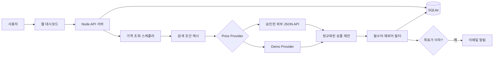

# 최저가 레이더

키워드와 상품 조건을 등록하면 **이용 권한이 있는 가격 데이터 API**를 통해 최저가를 추적하고, 목표가 도달 시 이메일로 알리는 서비스입니다.

> 쿠팡 HTML 스크래핑과 쿠팡 전용 런타임을 제거했습니다. 쿠팡 파트너스 승인을 받으면 별도 Provider로 추가할 수 있지만, 기본 서비스는 특정 쇼핑몰에 종속되지 않습니다.

## 핵심 기능

| 기능 | 설명 |
|---|---|
| 키워드 추적 | `#아이폰13pro` 같은 검색어 등록 |
| 매칭 필터 | 필수어 `256GB, 자급제`와 제외어 `케이스, 중고, 리퍼` 지원 |
| Provider 구조 | `demo` 또는 사용 승인을 받은 외부 JSON API 연결 |
| 검색 캐시 | 같은 검색 조건은 기본 10분 동안 결과 공유 |
| 적응형 조회 | 목표가 차이에 따라 30분~6시간 간격 적용 |
| 알림 쿨다운 | 목표가 이하가 유지돼도 기본 24시간 동안 중복 발송 방지 |
| 가격 이력 | SQLite에 최저가, 판매처, 링크, 확인 시각 저장 |

## 구조



## 실행

```bash
npm install
copy .env.example .env
npm run dev
```

브라우저에서 `http://localhost:3000`을 엽니다.

## 환경 변수

처음에는 안전한 데모 모드로 실행합니다.

```env
PRICE_PROVIDER=demo
EMAIL_USER=your_gmail@gmail.com
EMAIL_PASS=your_gmail_app_password
```

실제 데이터를 사용하려면 계약·승인된 API를 다음 정규화 계약으로 연결합니다.

```env
PRICE_PROVIDER=external
PRICE_API_URL=https://your-approved-price-api.example.com/search
PRICE_API_KEY=your_api_key
PRICE_CACHE_MS=600000
NOTIFICATION_COOLDOWN_MS=86400000
```

요청:

```http
GET {PRICE_API_URL}?q=아이폰13pro
Authorization: Bearer {PRICE_API_KEY}
Accept: application/json
```

응답:

```json
{
  "items": [
    {
      "id": "product-1",
      "name": "아이폰 13 Pro 256GB 자급제",
      "price": 699000,
      "seller": "공식 판매처",
      "url": "https://seller.example.com/product-1",
      "imageUrl": "https://seller.example.com/product-1.jpg"
    }
  ]
}
```

## Provider 추가

`src/providers`에 `PriceProvider` 구현체를 추가하고 `src/providers/index.ts`에 등록합니다.

```ts
export interface PriceProvider {
  id: ProviderId;
  label: string;
  isConfigured(): boolean;
  search(request: SearchRequest): Promise<SearchResult | null>;
}
```

공급자마다 다음을 반드시 확인해야 합니다.

- API 이용 목적과 재노출 허용 여부
- 결과 저장 및 캐시 허용 기간
- 호출량·과금·출처 표시 조건
- 상품 URL 수정 금지 여부
- 가격 이력 저장 가능 여부

## 현재 데이터베이스

기존 SQLite DB는 자동 마이그레이션됩니다. `watch_items`에 다음 컬럼이 추가됩니다.

- `required_terms`
- `excluded_terms`
- `provider`

운영 배포에서는 Web/API 서버와 가격 조회 Worker를 분리하고 PostgreSQL로 이전하는 것을 권장합니다.

## 배포 권장 구성

```text
Frontend/API: Railway 또는 Render
Database: Supabase PostgreSQL
Worker: Railway/Render Background Worker
Email: Resend 또는 Amazon SES
Scheduler: DB Job 또는 BullMQ + Redis
```

현재 저장소는 단일 프로세스 MVP이므로 한 인스턴스 배포에 적합합니다. 다중 인스턴스로 확장하기 전에 스케줄러를 별도 Worker로 분리해야 합니다.

## 제한사항

- `demo` Provider의 가격은 실제 쇼핑몰 가격이 아닙니다.
- 키워드 검색은 정확한 모델 선택보다 오탐 가능성이 높습니다.
- 외부 API의 저장·표시 정책에 따라 가격 이력 기능을 조정해야 할 수 있습니다.
- 공개 배포 전 인증, 사용자별 데이터 분리, 요청 제한이 필요합니다.
- 이메일 주소는 개인정보이므로 개인정보 처리방침과 삭제 기능이 필요합니다.

## 다음 단계

- [ ] 사용 권한이 확인된 실제 가격 Provider 연결
- [ ] 검색 결과 후보 중 정확한 상품을 선택하는 2단계 등록
- [ ] PostgreSQL과 별도 Worker 전환
- [ ] 사용자 로그인 및 개인정보 삭제
- [ ] 가격 이력 차트와 수동 조회
