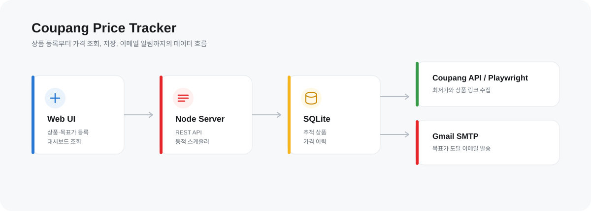
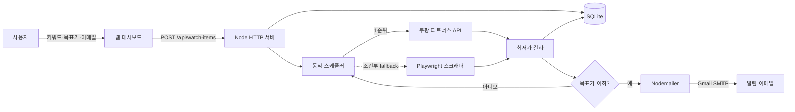
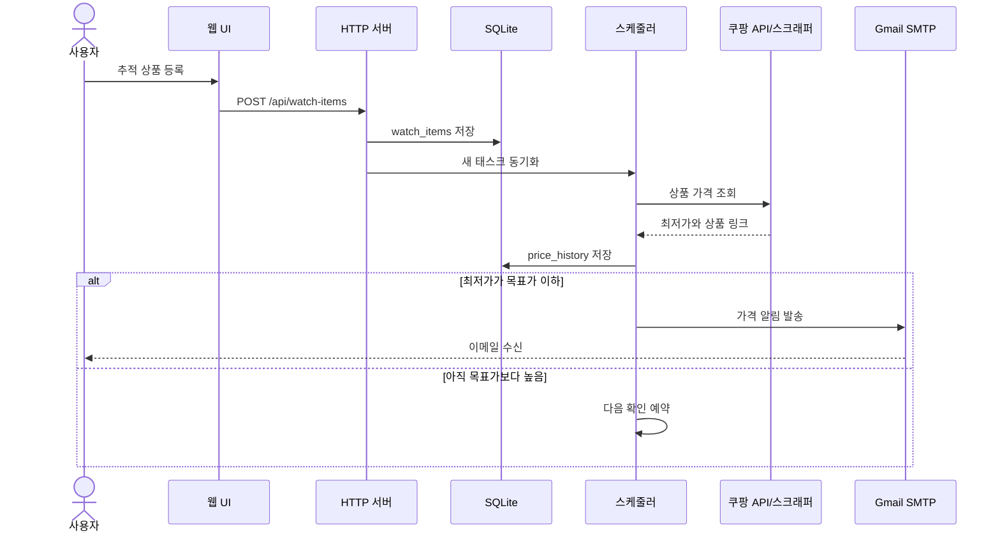

# 쿠팡 가격 추적기

> 쿠팡 상품 키워드의 최저가를 주기적으로 수집하고, 사용자가 설정한 목표 가격에 도달하면 이메일로 알려주는 개인용 가격 모니터링 서비스입니다.




## 핵심 기능

<table>
  <tr>
    <td width="50%" valign="top">
      <h3>🔎 상품 가격 추적</h3>
      <p>키워드와 목표 가격을 등록하면 쿠팡 파트너스 API를 우선 사용해 최저가를 수집합니다.</p>
    </td>
    <td width="50%" valign="top">
      <h3>⏱️ 동적 조회 주기</h3>
      <p>현재가와 목표가의 차이에 따라 6~20분 사이에서 다음 조회 주기를 조절합니다.</p>
    </td>
  </tr>
  <tr>
    <td width="50%" valign="top">
      <h3>📨 목표가 이메일 알림</h3>
      <p>최저가가 목표가 이하가 되면 Nodemailer와 Gmail SMTP를 통해 등록한 주소로 알림을 보냅니다.</p>
    </td>
    <td width="50%" valign="top">
      <h3>📊 가격 이력 저장</h3>
      <p>조회한 가격, 판매자, 상품 링크와 확인 시각을 SQLite에 누적합니다.</p>
    </td>
  </tr>
  <tr>
    <td width="50%" valign="top">
      <h3>🖥️ 웹 대시보드</h3>
      <p>상품 등록·삭제, 현재가, 목표가 접근률, 다음 확인 시각과 API 잔여량을 확인합니다.</p>
    </td>
    <td width="50%" valign="top">
      <h3>🧰 스크래퍼 보조 수단</h3>
      <p>API 호출이 어려운 일부 상황에서 Playwright 스크래퍼를 보조 수단으로 사용합니다.</p>
    </td>
  </tr>
</table>

## 기능 연결 흐름



### 등록부터 알림까지



## 기술 구성

| 영역 | 사용 기술 | 담당 역할 |
|---|---|---|
| Runtime | Node.js, TypeScript | 서버, 스케줄러, 가격 조회 로직 |
| Web | Node `http`, Vanilla JS, CSS | REST API와 반응형 대시보드 |
| Database | better-sqlite3, SQLite WAL | 추적 상품과 가격 이력 저장 |
| Price source | Coupang Partners API | 우선 가격 조회 수단 |
| Fallback | Playwright Chromium | 제한적인 HTML 스크래핑 보조 |
| Notification | Nodemailer, Gmail SMTP | 목표가 도달 이메일 발송 |
| Configuration | dotenv | 로컬 환경 변수와 비밀값 분리 |

## 연결별 의사 결정

| 연결 | 선택 | 선택 이유 | 트레이드오프와 다음 개선 |
|---|---|---|---|
| UI ↔ Server | REST JSON API | 프론트와 가격 수집 로직을 단순하게 분리할 수 있음 | 실시간 갱신은 30초 polling이므로 추후 SSE 고려 |
| Server ↔ DB | SQLite + 동기 API | 개인 프로젝트에서 설치와 운영이 간단하고 데이터량이 작음 | 다중 서버 확장 시 PostgreSQL로 이전 필요 |
| Scheduler ↔ Coupang | 파트너스 API 우선 | HTML 구조 변경과 봇 차단의 영향을 덜 받음 | API 승인·키·호출 제한이 필요함 |
| API ↔ Scraper | 조건부 fallback | API를 사용할 수 없는 상황에 최소한의 대체 경로 제공 | 현재 키 미설정 상황의 fallback 조건 보완 필요 |
| Server ↔ Mail | Gmail SMTP | 별도 메일 서비스 가입 없이 빠르게 검증 가능 | 앱 비밀번호 필요, 운영 환경에서는 SES·Resend 고려 |
| Scheduler ↔ Mail | 목표가 조건 충족 시 발송 | 사용자가 원하는 시점에만 알림 | 반복 조회마다 재발송될 수 있어 쿨다운 정책 추가 필요 |
| Browser ↔ Server | 30초 polling | WebSocket 없이 구현이 단순함 | 상품이 많아지면 변경분만 전달하는 방식이 효율적 |

## 실행 방법

### 1. 설치

```bash
npm install
npm run install:browsers
```

### 2. 환경 변수

```bash
copy .env.example .env
```

`.env`에 필요한 값을 입력합니다.

```env
COUPANG_ACCESS_KEY=쿠팡_파트너스_액세스_키
COUPANG_SECRET_KEY=쿠팡_파트너스_시크릿_키

EMAIL_USER=발송용_Gmail_주소
EMAIL_PASS=Gmail_앱_비밀번호

USE_SCRAPER_FALLBACK=true
SCRAPER_MIN_INTERVAL_MS=600000
PORT=3000
```

> `EMAIL_PASS`에는 일반 Gmail 비밀번호가 아닌 앱 비밀번호를 사용합니다. `.env`는 Git에서 제외되며 키를 README나 소스 코드에 직접 넣지 마세요.

### 3. 실행

```bash
npm run dev
```

브라우저에서 [http://localhost:3000](http://localhost:3000)을 엽니다.

```bash
# 기존 터미널 UI
npm run dev:cli

# TypeScript 빌드
npm run build

# 빌드 결과 실행
npm start
```

## 디렉터리 구조

```text
.
├─ public/                  # 대시보드 HTML, CSS, JavaScript
├─ src/
│  ├─ api/                 # 쿠팡 파트너스 API
│  ├─ db/                  # SQLite 스키마와 쿼리
│  ├─ notifier/            # 이메일 템플릿과 발송
│  ├─ scheduler/           # 동적 가격 조회 태스크
│  ├─ scraper/             # Playwright fallback
│  ├─ types/               # 공용 TypeScript 타입
│  ├─ index.ts             # 터미널 UI 진입점
│  └─ server.ts            # 웹 서버와 REST API
├─ data/                   # 로컬 SQLite DB (Git 제외)
└─ docs/images/            # README 이미지
```

## 현재 제약사항

- 키워드 검색은 다른 상품·용량·옵션의 가격을 최저가로 선택할 수 있습니다.
- 쿠팡 API 키가 없는 상황에서는 현재 fallback 조건이 충분하지 않아 안정적인 조회를 보장하지 않습니다.
- 쿠팡 페이지 구조 변경 또는 봇 차단으로 스크래퍼가 실패할 수 있습니다.
- 목표가 이하 상태가 유지되면 이메일이 반복 발송될 수 있어 알림 쿨다운이 필요합니다.
- 서버 프로세스가 종료되면 가격 추적도 중단됩니다.
- 공개 배포 전 인증과 API 요청 제한을 추가해야 합니다.

## 개선 우선순위

- [ ] 키 미설정 시 스크래퍼 fallback 보완
- [ ] 상품 URL 및 Product ID 기반 정확한 추적
- [ ] 알림 중복 방지와 재발송 쿨다운
- [ ] 가격 이력 차트
- [ ] 수동 즉시 조회
- [ ] 로그인과 사용자별 데이터 분리
- [ ] PostgreSQL 및 상시 실행 환경 배포

## 주의사항

이 프로젝트는 개인 학습용 도구입니다. 실제 운영 전 쿠팡 파트너스 정책, robots 정책, 요청 빈도와 관련 약관을 확인하세요. 표시된 가격과 재고는 변동될 수 있으므로 구매 전 쿠팡에서 최종 확인해야 합니다.
